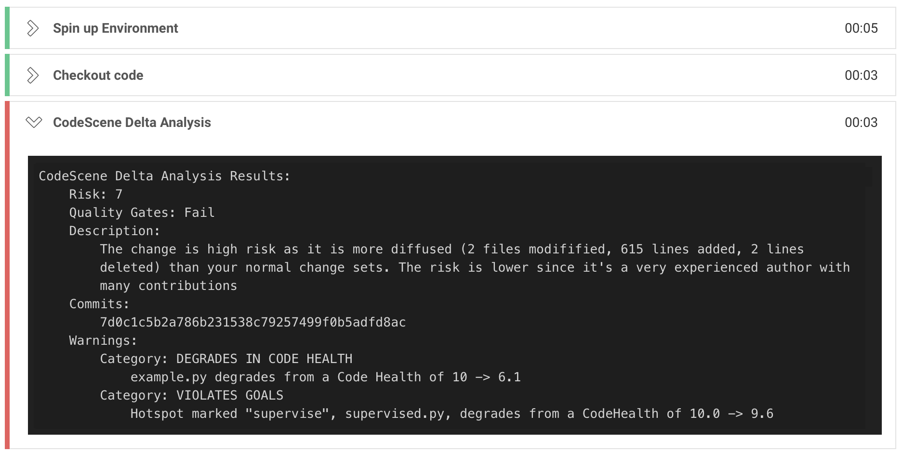
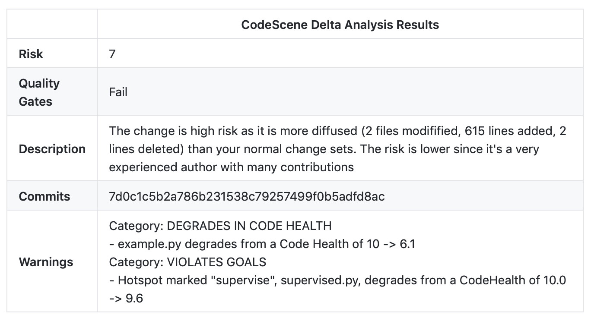

# codescene-ci-cd-orb
A Circle CI Orb for running [CodeScene Delta Analysis](https://docs.enterprise.codescene.io/versions/3.2.3/guides/delta/automated-delta-analyses.html#) in a CircleCI build workflow.

The orb uses [codescene-ci-cd](https://github.com/empear-analytics/codescene-ci-cd) through a [docker image](https://hub.docker.com/r/empear/codescene-ci-cd) to connect to a [CodeScene](https://empear.com/how-it-works/) instance doing the analysis. 

The result of the analysis will be visible in the CircleCI build log:





The orb will also create comments attached to GitHub commits or pull requests:




## Usage

Add the delta analysis to a workflow by using the `run-delta-analysis` job from the orb in your projects `config.yml` and use a context for setting variables common to all your projects by [codescene-ci-cd](https://github.com/empear-analytics/codescene-ci-cd):
```
version: 2.1
orbs:
  codescene-ci-cd: empear/codescene-ci-cd@1.1.1
workflows:
  version: 2
  my-workflow:
    jobs:
      - codescene-ci-cd/run-delta-analysis:
          context: codescene-ci-cd
```

The variables required are :

| Variable | Description |
| ------------- |-------------|
| CODESCENE_USER | A bot user created in codesene for accessing the API. |
| CODESCENE_PASSWORD | The password for the bot user. 
| CODESCENE_GITLAB_API_TOKEN | A personal access token created in GitLab. |
| CODESCENE_DELTA_ANALYSIS_URL | The full URL to the [CodeScene Delta Analysis REST API](https://docs.enterprise.codescene.io/versions/3.2.3/guides/delta/automated-delta-analyses.html#the-rest-api-for-delta-analyses). Retrievable from the CodeScene GUI. Note that this is project specific and thus must be set in the project settings rather than in the context.|
